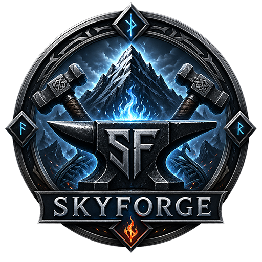

  

# SKYFORGE

Projet personnel de création d’un modpack **Skyrim Special Edition 1.5.97** basé sur une fusion raisonnée entre les références **Nolvus** et **Nefaram**.

SKYFORGE vise une installation Skyrim stable, cohérente, documentée étape par étape, avec une approche prudente : installation progressive, tests réguliers, décisions différées quand un choix dépend de modules futurs.

---

## Suivre l’avancement du projet

### ➜ [Lire le dernier changelog / résumé de validation](docs/procedure/99_changelog_validation_part_3.md)

C’est le meilleur point d’entrée pour suivre l’évolution actuelle du modpack : dernières étapes validées, modules terminés ou en cours, décisions importantes, état de stabilité et prochaine reprise.

> Le changelog précédent reste disponible ici : [Changelog / validation — partie 2](docs/procedure/99_changelog_validation_part_2.md).  
> Le changelog historique principal reste disponible ici : [Changelog / validation — partie 1](docs/procedure/99_changelog_validation.md).

### Liens utiles

- [Résumé de l’état actuel](docs/procedure/00_resume_etat_actuel.md)
- [Procédure principale de reproduction](docs/SKYFORGE_Procedure_Reproduction_PC.md)
- [Module 07 — Cities, towns, interiors & lighting](docs/procedure/11_cities_towns_interiors_lighting.md)
- [Module 07 — Cities, towns, interiors & lighting — partie 2](docs/procedure/11_cities_towns_interiors_lighting_part_2.md)
- [Module 07 — Cities, towns, interiors & lighting — partie 3](docs/procedure/11_cities_towns_interiors_lighting_part_3.md)
- [Module 07 — Cities, towns, interiors & lighting — partie 4](docs/procedure/11_cities_towns_interiors_lighting_part_4.md)
- [Module 07 — Cities, towns, interiors & lighting — partie 5](docs/procedure/11_cities_towns_interiors_lighting_part_5.md)
- [Décisions différées et points à revoir](docs/procedure/06_decisions_differees.md)
- [Décisions différées — partie 2](docs/procedure/06_decisions_differees_part_2.md)
- [Décisions différées — partie 3](docs/procedure/06_decisions_differees_part_3.md)
- [Audit de continuité des étapes](docs/procedure/98_audit_continuite_etapes.md)

---

## État actuel

- **Dernière étape validée :** Étape 327 — Pause technique Nexus
- **Dernière étape d’installation validée :** Étape 326 — Ryn’s Standing Stones
- **Module en cours :** 07 - CITIES TOWNS INTERIORS LIGHTING
- **Sous-bloc en cours :** 07.4 - LANDS
- **Compteur confirmé :** ESP + ESM non-light : 79
- **Pause technique :** Nexus temporairement instable, installations suspendues
- **Runtime :** Skyrim SE 1.5.97 Best of Both Worlds
- **Contenus AE / Creation Club :** conservés
- **Gestionnaire :** Mod Organizer 2 portable
- **Méthode :** installation mod par mod ou par petits blocs cohérents
- **Validation régulière :** SKSE via MO2 → menu principal → aucun master manquant → aucun message DLL bloquant → `Overwrite` vide
- **LOOT :** non lancé pour l’instant
- **LOD / DynDOLOD :** non générés pour l’instant

L’état exact le plus récent est toujours consigné dans le [dernier changelog](docs/procedure/99_changelog_validation_part_3.md) et dans le [résumé de l’état actuel](docs/procedure/00_resume_etat_actuel.md).

---

## Objectif

Construire une installation Skyrim stable, cohérente et patchée proprement :

- **Nolvus** sert de référence principale pour le socle technique, graphique, gameplay, UI, monde, villes, quêtes, combat et magie.
- **Nefaram** sert de référence secondaire pour les systèmes avancés, immersion, roleplay, outfits et contraintes de compatibilité.

Le but n’est pas de copier deux modlists complètes, mais d’en extraire les idées, les méthodes et les systèmes utiles pour bâtir un modpack personnel maîtrisé.

---

## Règle principale

Ne jamais fusionner deux modlists complètes aveuglément.

Extraire, tester et intégrer les systèmes progressivement.

Chaque ajout doit pouvoir être justifié, testé et documenté. En cas de doute, la décision est différée plutôt que forcée.

---

## Utilisation du dépôt

Ce dépôt sert uniquement à stocker des fichiers légers liés au projet :

- documentation technique ;
- décisions importantes ;
- checklists ;
- fichiers de configuration ;
- patches personnels éventuels ;
- scripts éventuels.

Il ne contient pas et ne doit pas contenir :

- archives de mods ;
- textures ;
- meshes ;
- dossiers complets MO2 ;
- backups Skyrim ;
- fichiers Bethesda / Creation Club ;
- fichiers SKSE ;
- fichiers provenant directement de mods soumis à permissions.

---

## Notes importantes

SKYFORGE est un projet personnel en construction. Les étapes documentées reflètent l’état validé au moment des tests, pas une recommandation universelle prête à l’emploi.

Les choix techniques peuvent évoluer au fur et à mesure de l’installation des modules suivants : villes, éclairage, météo, ENB, animations, gameplay, quêtes, patches finaux, BodySlide, Pandora / Nemesis, LOD et DynDOLOD.
